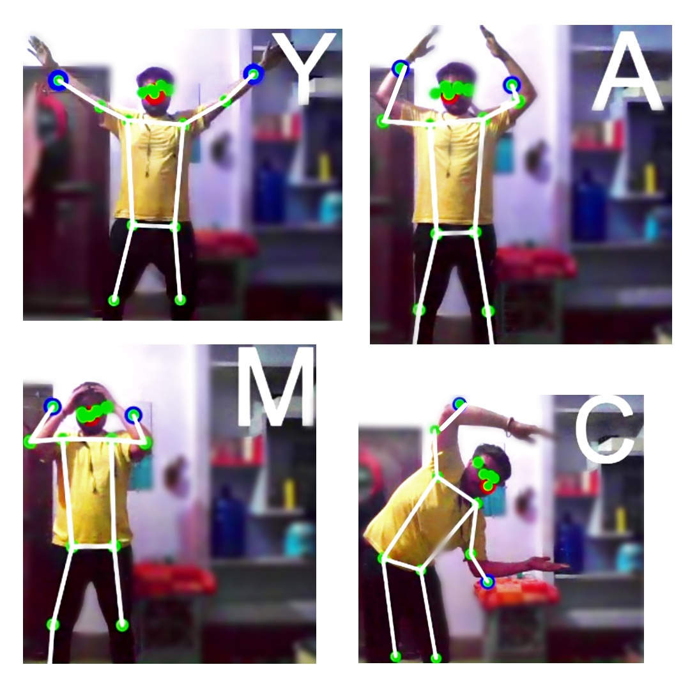

# PoseMaster

Welcome to PoseMaster, a project that utilizes machine learning to detect the pose of a person in real-time using a webcam. The project is powered by PoseNet, a part of the ML5.js library, which is a pre-trained model capable of estimating a person's pose in both images and video streams.

## Overview

PoseMaster provides an engaging and interactive experience by leveraging the capabilities of machine learning. Through a dynamic stick figure overlay on the video stream, PoseMaster visualizes key points representing the detected pose. 

## Features

- **Real-time Pose Detection**: PoseMaster detects the pose of a person in real-time using a webcam.
- **Alphabet Pose Recognition**: The model is trained to recognize four alphabet poses: Y, A, M, and C.
- **Interactive Experience**: When a user strikes one of these poses, the corresponding letter is displayed on the screen, showcasing the accuracy and responsiveness of the machine learning model.

## How to Get Started

To experience PoseMaster, simply click the "Get Started" button on the homepage of the project website. This will redirect you to the main project page where PoseNet is actively working.

## Contact

Have feedback or questions about PoseMaster? Feel free to contact me using the form provided on the project's contact page. Your input is valuable in further improving the project.

## Project Website

PoseMaster is hosted on Vercel. You can view the project website and interact with the application [here](https://vercel.com/nakul-jain14s-projects/pose-master/C1Y8x3amN2ubLJinZgzUTWtUjMKX).

## Screenshot!

## Built With

- [PoseNet](https://github.com/ml5js/ml5-library/tree/master/src/poseNet) - A pre-trained model for pose estimation.
- [ML5.js](https://github.com/ml5js/ml5-library) - A JavaScript library for machine learning.

## Contributing

We welcome contributions to the project. Please submit a pull request with your changes.

## Authors

- Nakul Jain - Initial work

## Acknowledgments

- [PoseNet](https://github.com/ml5js/ml5-library/tree/master/src/poseNet)
- [ML5.js](https://github.com/ml5js/ml5-library)
